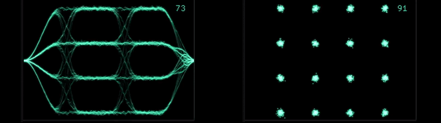

# 3djax: Explorations of a 200Gbps DCI transceiver in JAX.

**[View the Architecture Presentation (PDF)](src/3djax/docs/200G_DCI_Lane_Architecture.pdf)**

> Two-level explorations:
* Search for Inner/Outer coding solutions to go from 1e-3 to 1e-12 BER in AWGN.
* Search for timing, system structures, e.g., PAM-8 + timing recovery. 

## Philosophy of the project
Enabling tradeoffs between various architecture decisions requires efficient simulations. JAX is a great tool to achieve this. It provides the ease of writing Python and the efficiency of compiling code on GPUs and TPUs. The implementations of this project show how to achieve simulations in the range of 1e-12 bit error rates on a GPU by writing fully vectorized operations that remain highly readable in Python.
 
## Installation 

```bash
cd ~/venvs
python3.11 -m venv venv3.12-3djax
source ~/venvs/venv3.12-3djax/bin/activate
```

## Overview
The first part of the project combines an inner LDPC code with an outer BCH. Each encoder/decoder pair is analyzed separately first, and together second. We explore the influence of algorithms and arithmetic on LDPC, and the balance and tradeoffs involved in transferring compute complexity between BCH and LDPC, as well as between different processing blocks.

### EyeMon: Hardware-Accelerated Signal Visualization

EyeMon is a high-performance, GPU-accelerated signal monitoring tool designed for visualizing complex multi-level waveforms and multi-level quadrature constellations. 

<p align="center">
  
</p>
---

### LDPC (`src/3djax/ldpc`)
Contains the LDPC56 encoding and decoding implementations along with QPSK modulation. 
* **Validation:** The Bit Error Rate (BER) vs. Signal-to-Noise Ratio (SNR) performance of our implementation has been directly compared against a standard MATLAB reference. The fully vectorized JAX implementation perfectly matches the MATLAB reference curve while enabling massive simulation throughput.

### DSP Core (`src/3djax/dsp_core`)
Implements the digital signal processing front-end and receiver pipeline, including ADC, AGC, Feed-Forward Equalization (FFE), and phase detection.
* **Analysis:** The DSP tests (`test_dsp_core.py`) generate time-domain plots to visualize signal recovery, equalizer convergence, and phase tracking behavior.
* **Training Timeline:**

```mermaid
gantt
    title Transceiver DSP Training Timeline
    dateFormat  X
    axisFormat %s
    
    section Acquisition
    AGC Settling            :a1, 0, 10
    Timing/Phase Recovery   :a2, after a1, 20
    
    section Equalization
    FFE Tap Training        :a3, after a2, 30
    
    section Tracking
    Steady-State Tracking   :a4, after a3, 40
```



### BCH (`src/3djax/bch`)
Handles the outer BCH error-correction coding (`bch_encode.py`, `bch_decode.py`). This layer cleans up the residual errors left over by the inner LDPC decoder, driving the final performance down to the 1e-12 BER target.


### Monitor
scope inspired by 
https://github.com/RandomDude4/PhosPersPlot